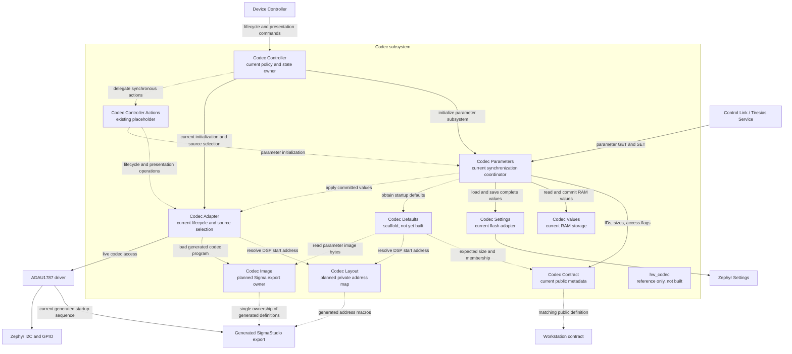
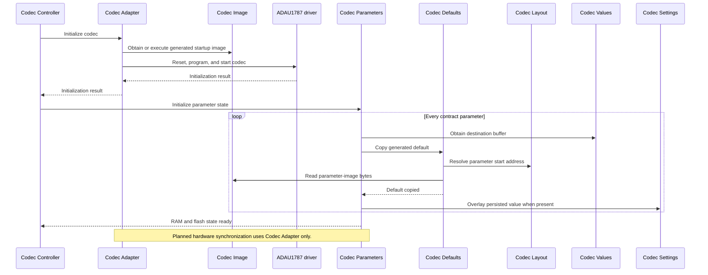

# Codec Subsystem

This page defines the intended module boundaries for codec lifecycle, DSP
parameter storage, persistence, generated defaults, and live ADAU1787 access.
It shows both the current proof-of-concept path and the planned hardware
integration path.

In the diagrams, solid arrows are current dependencies and dashed arrows are
planned dependencies. An arrow points from a caller to the module or resource
it uses.

## Module interaction



The target dependency direction keeps policy above mechanisms:

```text
Codec Controller
    -> Codec Parameters      (RAM, flash, and revision coordination)
    -> Codec Adapter         (all live hardware operations)

Codec Parameters
    -> Codec Contract        (public identity and bounds)
    -> Codec Values          (volatile bytes)
    -> Codec Defaults        (generated startup bytes)
    -> Codec Settings        (persistent bytes)
    -> Codec Adapter         (planned live-memory synchronization)

Codec Defaults / Codec Adapter
    -> Codec Layout          (private ID-to-DSP-address mapping)
    -> Codec Image           (generated SigmaStudio data)

Codec Adapter
    -> ADAU1787 driver
        -> Zephyr I2C and GPIO
```

## Responsibilities and boundaries

| Module | Status | Owns | Must not own |
|---|---|---|---|
| Codec Controller | Current | Codec lifecycle, presentation state, command acceptance, fallback policy, and error state | Parameter buffers, flash keys, raw DSP addresses, generated-image parsing, or I2C/GPIO details |
| Codec Controller Actions | Existing placeholder | If retained, small synchronous operations invoked by Codec Controller so state transitions remain readable and testable | A second state machine, its own thread, public parameter state, or direct BLE handling |
| Codec Contract | Current | Stable public parameter IDs, block IDs, byte counts, access flags, lookup, and contract fingerprint | DSP addresses, SigmaStudio names, mutable values, persistence, or hardware operations |
| Codec Parameters | Current | Parameter-operation validation, mutex ownership, initialization ordering, revision tracking, and synchronization policy across defaults, RAM, flash, and eventually codec memory | Buffer declarations, Zephyr Settings key mechanics, generated-image layout, raw bus access, or DSP-address ownership |
| Codec Values | Current | Fixed mutable RAM buffers and ID-to-buffer lookup | Defaults, flash, revisions, locking policy, DSP addresses, SigmaStudio includes, or codec access |
| Codec Settings | Current | Mapping a validated parameter ID to its Zephyr Settings key and copying one complete value to or from flash | Contract interpretation, RAM ownership, defaults, revisions, or codec access |
| Codec Defaults | Scaffold | Copying one contract parameter's default bytes from the generated parameter image into a caller-provided buffer, including image-range validation | Runtime buffer ownership, flash access, revisions, hardware communication, or lifecycle policy |
| Codec Layout | Planned | The immutable private mapping from stable parameter ID to physical DSP start address | Public protocol metadata, parameter bytes, persistence, generated program data, or bus communication |
| Codec Adapter | Current lifecycle and source selection; parameter read remains a stub | The only codec-subsystem gateway for initialization, presentation changes, and live parameter-memory reads or writes; translation of operation failures into errno-style results | BLE protocol handling, flash policy, RAM ownership, revisions, or controller state |
| Codec Image | Planned | Single ownership of definition-bearing SigmaStudio exports and narrow access to the program/parameter images required by Codec Adapter and Codec Defaults | Public parameter identity, runtime state, persistence policy, or controller state |
| `hw_codec` | Reference only, excluded from CMake | Legacy behavior retained for comparison with Codec Adapter | Runtime callers or new functionality |
| ADAU1787 driver | Current driver layer | Devicetree access, power/reset and GPIO sequencing, register and memory primitives, device timing, and I2C error reporting | Stable public parameter IDs, BLE semantics, flash persistence, revisions, or presentation policy |

`standard_profiles.h` is currently unreferenced data rather than an owned module.
It must not become a second source of startup defaults while the SigmaStudio
parameter image is authoritative. A future profile feature needs its own
explicit product-level ownership and merge policy.

## State ownership

The parameter subsystem has three distinct copies of a value. They must not be
collapsed into one module merely because their bytes have the same shape.

| Location | Owner | Meaning |
|---|---|---|
| Runtime RAM | Codec Values | Value served to Control Link and used as the firmware's committed runtime view |
| Internal flash | Codec Settings | Value restored across boots under an ID-keyed settings entry |
| ADAU1787 parameter memory | Codec Adapter through the driver | Value currently active in the DSP |

Codec Parameters owns the ordering between these locations. The storage and
hardware modules only perform the operation requested of them; they do not
decide which copy is authoritative or advance the revision.

## Planned initialization flow



The generated default is copied before loading flash. A missing settings key
therefore leaves the SigmaStudio default intact instead of replacing it with
zeroes. The exact recovery policy for a failed hardware write or flash save
remains owned by Codec Parameters and must be defined when live synchronization
is implemented.

## Hard boundaries

1. **Public identity stops at Codec Contract.** DSP addresses are private and
   may change with a SigmaStudio export without changing the BLE contract.
2. **Mutable bytes stop at Codec Values.** No other module declares a second
   runtime buffer for the same parameter.
3. **Flash mechanics stop at Codec Settings.** Only Codec Parameters decides
   when a value should be persisted.
4. **Live hardware access stops at Codec Adapter.** Codec Parameters, Codec
   Defaults, Codec Values, Codec Settings, Control Link, and Codec Controller
   never call the ADAU1787 driver directly in the target design.
5. **Generated definitions have one owner.** A definition-bearing SigmaStudio
   header must be included by one translation unit only. Other modules use a
   narrow Codec Image interface to avoid duplicate symbols and generated-code
   leakage.
6. **Legacy code is reference only.** `hw_codec` remains unchanged in the repository
   but is excluded from CMake. Codec Controller uses Codec Adapter for initialization
   and source selection, still gated by `CONFIG_AUDIO_CODEC_ADAU1787`.

## Current exceptions to the target boundary

- `codec_contract.h` currently includes `adau1787.h` to obtain the four-byte
  parameter-word width. The target contract should use codec-level metadata so
  the public contract no longer depends on a hardware driver header.
- Codec Adapter's parameter interface currently accepts raw start addresses; reads return `-ENOTSUP`.
  Its completed upper interface should accept stable parameter identity and
  keep physical-address lookup behind Codec Adapter and Codec Layout.
- The ADAU1787 driver currently includes and executes the definition-bearing
  SigmaStudio export directly. Codec Image is the planned single-owner boundary
  that removes generated definitions from consumers.
- Codec Defaults and Codec Controller Actions exist only as incomplete
  scaffolds; Codec Defaults is not yet part of the CMake target.

## Transition from the current build

1. Complete Codec Defaults and add it to the build.
2. Add Codec Layout as the sole parameter-address map.
3. Add the single-owner Codec Image boundary for the generated export.
4. Initialize Codec Values from Codec Defaults before overlaying Codec Settings.
5. Implement Codec Adapter using Codec Layout, Codec Image, and the ADAU1787
   driver.
6. Route Codec Controller actions and planned parameter-memory synchronization
   through Codec Adapter.
7. Hardware-validate the migrated initialization and source-selection behavior against
   the retained `hw_codec` reference; the legacy build dependency has been removed.
