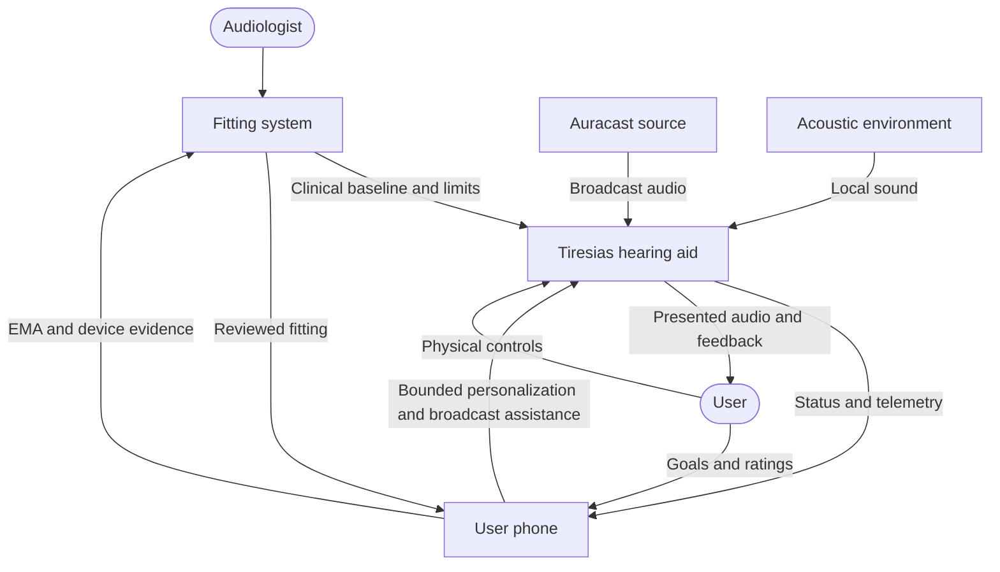
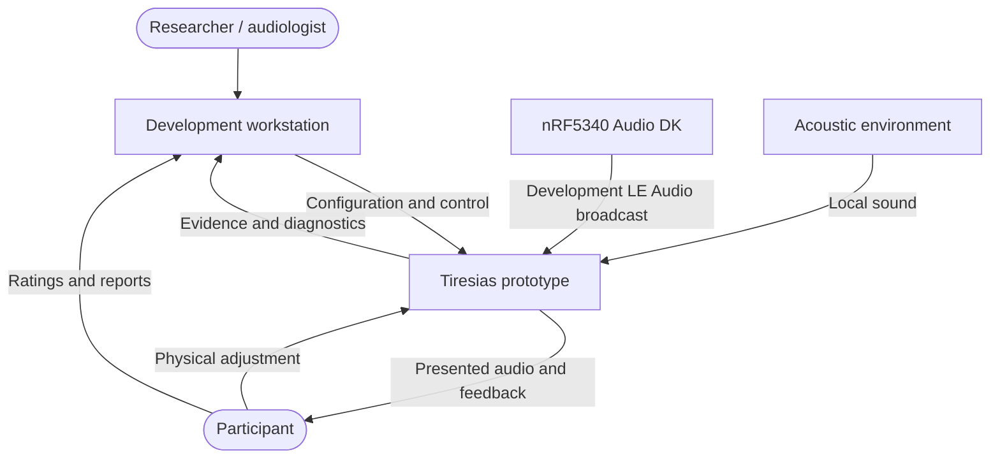

# System Context

## Intended system

- The audiologist owns the clinical baseline and safe adjustment envelope.
- The user makes reversible adjustments inside that envelope.
- The phone provides control, Broadcast Assistant behavior, updates, and data relay.
- The fitting system stores and presents longitudinal evidence for review.

## Current proof of concept

The workstation currently combines the future phone and fitting-system roles. The nRF5340
Audio DK is a development broadcaster, not an Auracast implementation.

## System boundary

Inside the Tiresias system:

- Tiresias DK hardware and nRF5340 firmware;
- ADAU1787 codec, DSP configuration, microphones, and output transducer;
- local controls, indicators, and power management.

People, phones, workstations, broadcasters, tools, and the acoustic environment are
external. See [control-link.md](control-link.md) for BLE control and Broadcast Assistant
boundaries.
